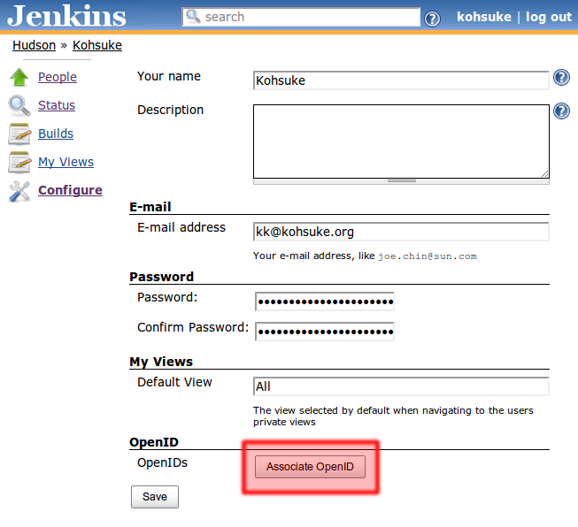
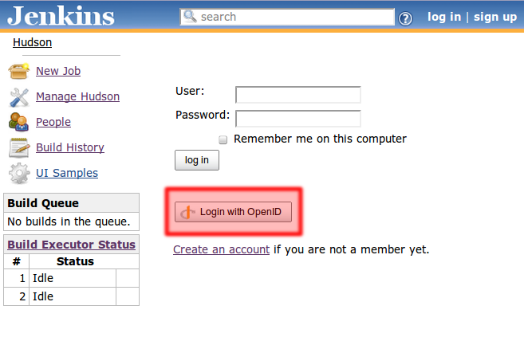
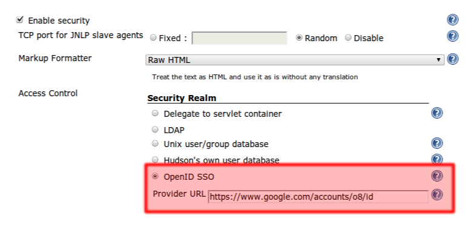

[.conf-macro .output-inline]##

[cols="",options="header",]
|===
|Plugin Information
|View openid https://plugins.jenkins.io/openid[on the plugin site] for
more information.
|===

[.aui-icon .aui-icon-small .aui-iconfont-error .confluence-information-macro-icon]##

The current version of this plugin may not be safe to use. Please review
the following warnings before use:

* https://jenkins.io/security/advisory/2019-04-03/#SECURITY-1084[CSRF
vulnerability and missing permission check allow SSRF]

[.aui-icon .aui-icon-small .aui-iconfont-warning .confluence-information-macro-icon]##

*This plugin is up for adoption.* Want to help improve this plugin?
https://wiki.jenkins-ci.org/display/JENKINS/Adopt+a+Plugin[Click here to
learn more]!

This plugin lets your Jenkins users login to Jenkins through external
OpenID providers, without using password.(Or in the OpenID terminology,
this plugin makes Jenkins http://en.wikipedia.org/wiki/OpenID[a relying
party].

The plugin has two somewhat different mode of operations:

. *'On the side' mode*: Keep the existing security realm and just use
OpenID as a way to login without typing a password. That is, Jenkins is
still taking user/group information from some source (such as Active
Directory, LDAP, etc.), and with this plugin useres can now login to
their user accounts by associating OpenID with their accounts.
. *SSO mode*: You'll designate one OpenID provider as the authoritative
source of the user information in Jenkins. The user must login through
this OpenID provider, and the user account will be automatically created
and linked to it.

*Table of content*

[[OpenIDplugin-'Ontheside'mode]]
== 'On the side' mode

As of 2.1 this mode is off by default for new installations. Upgrades
should retain the configuration as on. In this mode, the user will first
associate OpenIDs with their user accounts (by clicking their name on
the top right of the page and then "Configure", after logging in
normally):

[.confluence-embedded-file-wrapper .image-center-wrapper]##

This will initiate a wizard that allows the user to associate OpenIDs to
this account. Once this is setup, the user can login to his/her account
with this OpenID, without remembering the password:

[.confluence-embedded-file-wrapper .image-center-wrapper]##

In this mod "on the side" mode, OpenID is just used as a means to bypass
the use of password.

[[OpenIDplugin-SSOmode]]
== SSO mode

This mode makes Jenkins completely rely on single external OpenID
provider as the user realm. Use of OpenID in this mode is no longer just
a convenience — you have to "belong" to the configured OpenID provider
to be able to login to Jenkins.

First, the administrator will configure the system and designate the
OpenID provider:

[.confluence-embedded-file-wrapper .image-center-wrapper]##

Here you need to specify which OpenID provider you'll be delegating
authentication to. You do this either by specifing the "OpenID Provider
Endpoint URL" (as defined by
http://openid.net/specs/openid-authentication-2_0.html#terminology[the
spec]), or by specifying one OpenID identifier and let Jenkins figure
out where the OP Endpoint URL is. The latter is often easier as it can
be sometimes rather complicated to find out what the actual OP Endpoint
URL is.

Once Jenkins is configured this way, the user is automatically sent to
this OpenID provider whenever Jenkins determines that the user needs to
be authenticated. This includes accessing a protected page and clicking
a login link, and it happens *without the user clicking a "login with
OpenID" button*.

Combined with the option in typical OpenID providers to bypass the
confirmation dialog after the first login, this creates a single sign-on
experience where the user never have to explicitly login to access
Jenkins.

[[OpenIDplugin-AutomaticReadAccess]]
=== Automatic Read Access

By default, users who authenticate via OpenID have no rights, not even
the right to see the Jenkins GUI. To grant a right to all OpenID users,
add a user "authenticated" and grant them the desired right. Typically
this will be Overall/Read.

[[OpenIDplugin-Teamextensionsupport]]
=== Team extension support

This implementation supports https://dev.launchpad.net/OpenIDTeams[the
OpenID team extension] to retrieve group membership information from
OpenID providers.

[.aui-icon .aui-icon-small .aui-iconfont-warning .confluence-information-macro-icon]#
#

because of the way the protocol works, the group membership information
is retrieved on a login. If you are added as a member of a new team, or
if you modify ACLs in Jenkins and added a row for a new group, you'll
have to relogin for Jenkins to recognize your membership in this new
group.

[[OpenIDplugin-SSOmodeconfigurationideas]]
=== SSO mode configuration ideas

* If you deny the read access to the anonymous user on your Jenkins,
people will automatically get authenticated va OpenID whenever they
access Jenkins. This is very convenient to keep track of who's making
what changes in Jenkins, but without bothering the user.

* You can take it one step further, and grant the read access to
specific teams in the OpenID provider. This allows you to restrict the
use of Jenkins to a subset of those who have identities on the OpenID
provider (as opposed to everyone with an account.)

[[OpenIDplugin-WorkingwithGoogleApps]]
== Working with Google Apps

This plugin supports Google Apps as an OpenID provider. Select "Google
Apps SSO (with OpenID)" in the UI and type in your domain name. In this
way, users must have a valid user account on your domain to be able to
login.

Google is phasing out OpenID 2.0 support and
will https://developers.google.com/+/api/auth-migration#timetable[turn
off OpenID logins by April 20th, 2015]. You should migrate to the
new https://wiki.jenkins-ci.org/display/JENKINS/Google+Login+Plugin[google-login] plugin
which also supports Google Apps domain restriction.

[[OpenIDplugin-ReleaseHistory]]
== Release History

[[OpenIDplugin-Version2.3(Jan25,2019)]]
=== Version 2.3 (Jan 25, 2019)

* https://issues.jenkins-ci.org/browse/JENKINS-55683[JENKINS-55683] Fixed
infinite redirect loop on Jenkins 2.150.2/2.160

[[OpenIDplugin-Version2.2(Oct10,2016)]]
=== Version 2.2 (Oct 10, 2016)

* https://issues.jenkins-ci.org/browse/JENKINS-36499[JENKINS-36499] -
Updated to use the plugin parent pom
* https://issues.jenkins-ci.org/browse/JENKINS-28859[JENKINS-28859] -
Drop Google App SSO code
* Fixed findbugs errors, cleanup

[[OpenIDplugin-Version2.1.1(Oct2,2014)]]
=== Version 2.1.1 (Oct 2, 2014)

* Fixed the escape hatch system property to disable the OpenID Teams
extension: -Dhudson.plugins.openid.impl.TeamsExtension.disable=true
* Added some alternative email attributes
* Fix proxy settings for discovery

[[OpenIDplugin-Version2.1(May15,2014)]]
=== Version 2.1 (May 15, 2014)

* Add a UI to allow easy access to disable/enable the federated login
service.
* Default the federated login service to disabled on new installations
(upgrades should retain enabled until configured otherwise)

[[OpenIDplugin-Version2.0(May14,2014)]]
=== Version 2.0 (May 14, 2014)

* Upgrade openid4java to version 0.9.8 to pick up critical security
fixes that the openid4java project recommend picking up.
* Provide a system property to disable the federated login service.

[[OpenIDplugin-Version1.8(Nov27,2013)]]
=== Version 1.8 (Nov 27, 2013)

* JENKINS-9978
* JENKINS-14843
* JENKINS-9792

[[OpenIDplugin-Version1.7(Jul24,2013)]]
=== Version 1.7 (Jul 24, 2013)

* ???

[[OpenIDplugin-Version1.6(Jan17,2013)]]
=== Version 1.6 (Jan 17, 2013)

* Improved the form validation
(https://issues.jenkins-ci.org/browse/JENKINS-16396[JENKINS-16396])
* Improved error diagnostics
(https://issues.jenkins-ci.org/browse/JENKINS-11746[JENKINS-11746])

[[OpenIDplugin-Version1.5(Jul11,2012)]]
=== Version 1.5 (Jul 11, 2012)

* Added Google Apps support.

[[OpenIDplugin-Version1.4(Oct27,2011)]]
=== Version 1.4 (Oct 27, 2011)

* Fixed a security vulnerability.

[[OpenIDplugin-Version1.3(Mar31,2011)]]
=== Version 1.3 (Mar 31, 2011)

* Improved the error diagnosis when the authentication session starts
under one host name and then the user is redirected back to another host
name, of the same Jenkins.

[[OpenIDplugin-Version1.2(Mar27,2011)]]
=== Version 1.2 (Mar 27, 2011)

* Fixed a bug in persistence
(https://issues.jenkins-ci.org/browse/JENKINS-9163[JENKINS-9163])

[[OpenIDplugin-Version1.1(Feb11,2011)]]
=== Version 1.1 (Feb 11, 2011)

* Use AX in addition to SReg to retrieve user information
(https://issues.jenkins-ci.org/browse/JENKINS-8732[JENKINS-8732])
* Fixed a bug in the reverse proxy setup
(https://issues.jenkins-ci.org/browse/JENKINS-8755[JENKINS-8755])

[[OpenIDplugin-Version1.0(Feb7,2011)]]
=== Version 1.0 (Feb 7, 2011)

* Initial release
